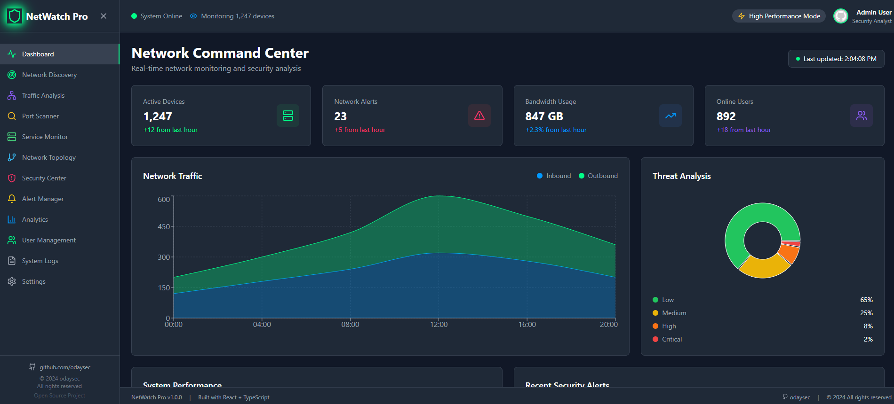
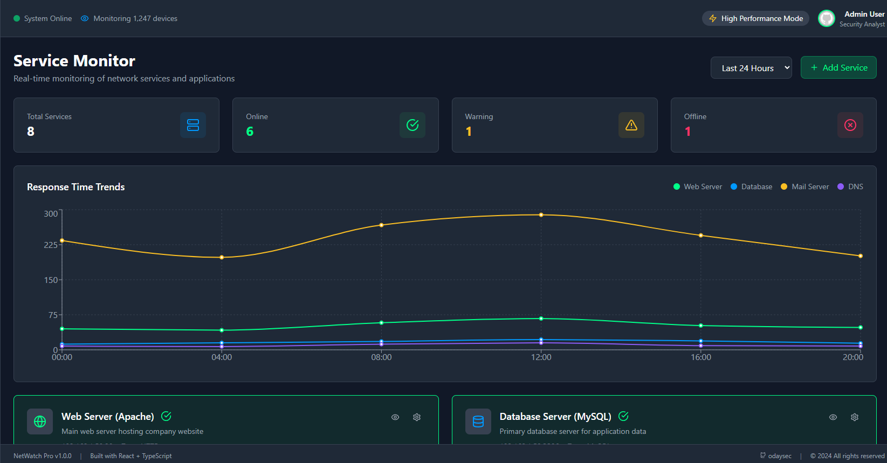
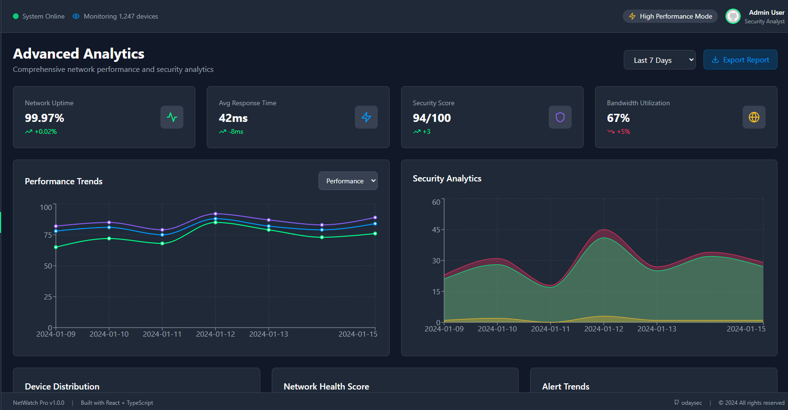
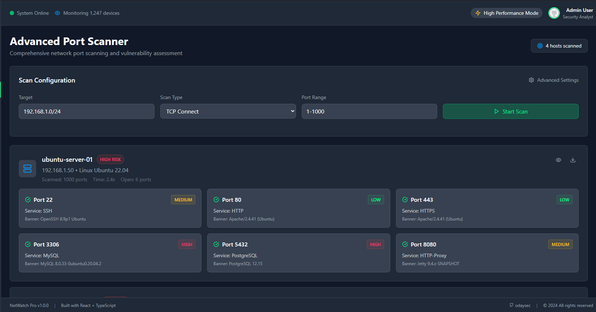
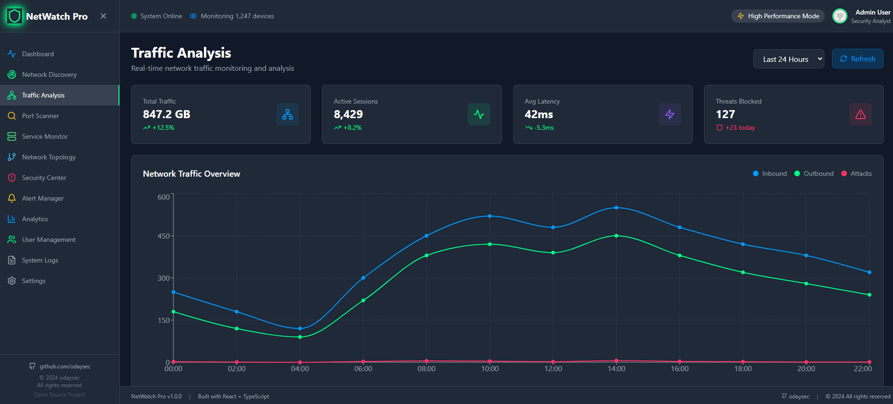
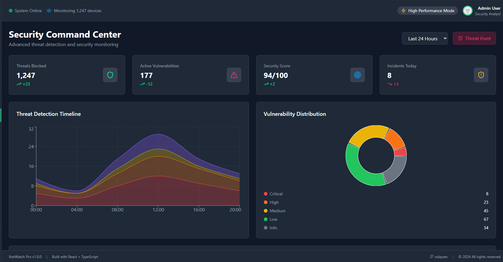
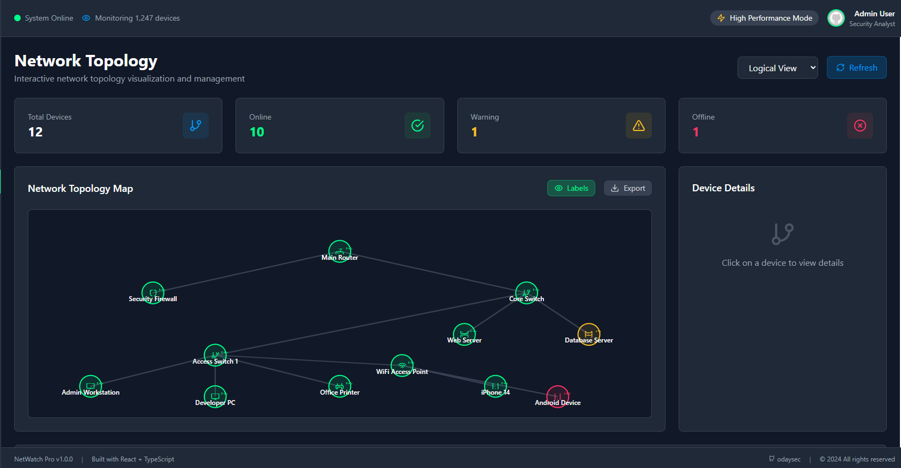
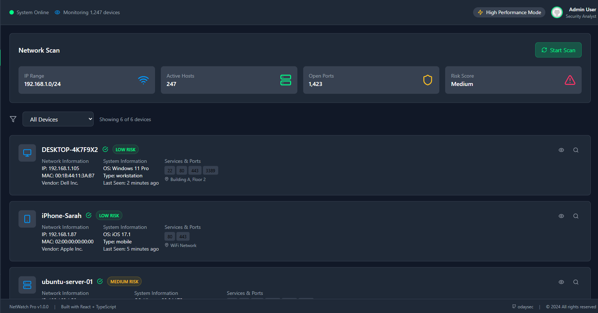

# NetWatch Pro - Advanced Network Monitoring System


## 🚀 Overview

**NetWatch Pro** is a comprehensive, production-ready network monitoring system designed for cybersecurity professionals, network administrators, and IT teams. Built with modern web technologies and featuring a professional-style interface, NetWatch Pro provides real-time network analysis, security monitoring, and infrastructure management capabilities.

### 🎯 Key Highlights

- **Real-time Network Monitoring** - Live traffic analysis and device discovery
- **Advanced Security Center** - Threat detection and incident response
- **Professional Interface** - Dark theme with cyber-security aesthetics
- **Comprehensive Analytics** - Performance metrics and compliance reporting
- **Multi-user Support** - Role-based access control and user management
- **Open Source** - MIT licensed and community-driven

## ✨ Features

### 🔍 Network Discovery & Analysis

#### **Real-time Network Discovery**
- Automatic device detection and fingerprinting
- Network topology mapping with interactive visualization
- Device classification (workstations, servers, mobile devices, IoT)
- OS detection and service identification
- SNMP-based device monitoring

#### **Advanced Port Scanning**
- TCP/UDP port scanning with customizable ranges
- Service banner grabbing and version detection
- Vulnerability assessment and CVE mapping
- Stealth scanning options
- Comprehensive scan reporting

#### **Traffic Analysis**
- Deep packet inspection and protocol analysis
- Bandwidth monitoring and utilization tracking
- Top talkers identification
- Traffic anomaly detection
- Real-time flow analysis

#### **Network Topology Mapping**
- Interactive network visualization
- Logical and physical topology views
- Layer 2/3 network mapping
- Device relationship tracking
- Export capabilities for documentation

### 🛡️ Security & Monitoring

#### **Security Command Center**
- Advanced threat detection engine
- Real-time security event monitoring
- Intrusion detection and prevention
- Malware detection and quarantine
- DDoS attack mitigation

#### **Alert Management System**
- Multi-channel notifications (Email, SMS, Slack)
- Customizable alert rules and thresholds
- Alert escalation and acknowledgment
- Incident response workflows
- Alert correlation and deduplication

#### **Service Health Monitoring**
- Application and service availability checks
- Performance monitoring and SLA tracking
- Health check automation
- Service dependency mapping
- Uptime and response time tracking

#### **Log Management**
- Centralized logging with advanced filtering
- Log correlation and analysis
- Security event logging
- Audit trail maintenance
- Log retention and archiving

#### **Compliance Dashboard**
- ISO 27001, SOC 2, GDPR, HIPAA, PCI DSS tracking
- Compliance reporting and documentation
- Risk assessment and scoring
- Policy enforcement monitoring
- Audit preparation tools

### 📊 Analytics & Reporting

#### **Advanced Analytics**
- Performance metrics and trend analysis
- Predictive insights with AI-powered analytics
- Custom dashboard creation
- Real-time data visualization
- Historical data analysis

#### **Real-time Dashboards**
- Live network metrics and KPIs
- Interactive charts and graphs
- Customizable widget layouts
- Multi-screen support
- Mobile-responsive design

#### **Custom Reports**
- Automated report generation
- Scheduled report delivery
- Export capabilities (PDF, CSV, JSON)
- Template-based reporting
- Executive summary reports

### 👥 User Management

#### **Role-Based Access Control**
- **Administrator** - Full system access and configuration
- **Analyst** - Network monitoring and analysis capabilities
- **Operator** - Basic monitoring and operational tasks
- **Viewer** - Read-only access to dashboards

#### **Multi-User Authentication**
- Secure login with session management
- Two-factor authentication (2FA) support
- Password policy enforcement
- User activity tracking
- Session timeout controls

#### **User Activity Tracking**
- Comprehensive audit trails
- Login/logout monitoring
- Action logging and accountability
- Security event correlation
- Compliance reporting

### ⚙️ System Configuration

#### **Comprehensive Settings**
- Network configuration and scanning parameters
- Security policies and thresholds
- Alert rules and notification channels
- User management and permissions
- System maintenance and backup

#### **Multi-language Support**
- English, Spanish, French, German, Japanese, Chinese
- Localized interface and documentation
- Cultural date/time formatting
- Regional compliance standards

#### **Theme Customization**
- Dark, light, and auto themes
- Cyber-security color schemes
- Customizable layouts
- Accessibility options
- Brand customization

## 🛠️ Technology Stack

### Frontend Technologies
- **React 18** - Modern component-based UI framework
- **TypeScript** - Type-safe development
- **Tailwind CSS** - Utility-first CSS framework with custom cyber theme
- **Recharts** - Advanced data visualization and charting
- **Lucide React** - Beautiful and consistent icons
- **React Router DOM** - Client-side routing

### Build & Development Tools
- **Vite** - Fast build tool and development server
- **ESLint** - Code linting and quality assurance
- **PostCSS** - CSS processing and optimization
- **Autoprefixer** - CSS vendor prefixing

### Design & UX
- **Responsive Design** - Mobile-first approach with breakpoints
- **Dark Theme** - Professional cybersecurity interface
- **Accessibility** - WCAG 2.1 compliant
- **Performance Optimized** - Lazy loading and code splitting

## 🚀 Quick Start

### Prerequisites

Before installing NetWatch Pro, ensure you have the following installed:

- **Node.js** 18.0.0 or higher
- **npm** 8.0.0 or higher (or **yarn** 1.22.0+)
- **Git** for version control

### Installation

1. **Clone the Repository**
   ```bash
   git clone https://github.com/odaysec/NetWatch.git
   cd NetWatch
   ```

2. **Install Dependencies**
   ```bash
   npm install
   ```

3. **Start Development Server**
   ```bash
   npm run dev
   ```

4. **Access the Application**
   Open your browser and navigate to `http://localhost:5173`

### Production Build

1. **Build for Production**
   ```bash
   npm run build
   ```

2. **Preview Production Build**
   ```bash
   npm run preview
   ```

3. **Deploy**
   The `dist` folder contains the production-ready files that can be deployed to any static hosting service.

## 📋 Project Structure

```
NetWatch/
├── public/                 # Static assets
├── src/                   # Source code
│   ├── components/        # Reusable UI components
│   │   └── Layout.tsx     # Main application layout
│   ├── pages/            # Application pages/views
│   │   ├── Dashboard.tsx          # Main dashboard
│   │   ├── NetworkDiscovery.tsx   # Network discovery tools
│   │   ├── TrafficAnalysis.tsx    # Traffic monitoring
│   │   ├── PortScanner.tsx        # Port scanning tools
│   │   ├── ServiceMonitor.tsx     # Service monitoring
│   │   ├── TopologyMap.tsx        # Network topology
│   │   ├── SecurityCenter.tsx     # Security operations
│   │   ├── AlertManager.tsx       # Alert management
│   │   ├── Analytics.tsx          # Advanced analytics
│   │   ├── UserManagement.tsx     # User administration
│   │   ├── Logs.tsx              # Log management
│   │   └── Settings.tsx          # System configuration
│   ├── App.tsx           # Main application component
│   ├── main.tsx          # Application entry point
│   └── index.css         # Global styles
├── docs/                 # Documentation
├── package.json          # Project dependencies
├── tailwind.config.js    # Tailwind CSS configuration
├── tsconfig.json         # TypeScript configuration
├── vite.config.ts        # Vite build configuration
└── README.md            # Project documentation
```

## 🎨 Screenshots

|  |  |
|:--:|:--:|
| **NCC Dashboard** | **Service Monitor** |

|  |  |
|:--:|:--:|
| **Advance Analytics** | **Advance Port Scanner** |

|  |  |
|:--:|:--:|
| **Traffic Analysis** | **Security Center** |

|  |  |
|:--:|:--:|
| **Network Topology** | **Network Discovery** |


## 🔧 Configuration

### Environment Variables

Create a `.env` file in the root directory:

```env
# Application Configuration
VITE_APP_NAME=NetWatch Pro
VITE_APP_VERSION=1.0.0

# API Configuration
VITE_API_URL=http://localhost:3001
VITE_WEBSOCKET_URL=ws://localhost:3001

# Security Configuration
VITE_SESSION_TIMEOUT=3600
VITE_MAX_LOGIN_ATTEMPTS=5

# Feature Flags
VITE_ENABLE_2FA=true
VITE_ENABLE_AUDIT_LOGGING=true
```

### Network Configuration

Configure default network settings in the Settings page:

- **Default Subnet**: Set your primary network range (e.g., `192.168.1.0/24`)
- **Scan Intervals**: Configure automatic discovery intervals
- **SNMP Communities**: Set up SNMP access for device monitoring
- **Port Ranges**: Define default port scanning ranges

### Security Settings

- **Session Management**: Configure timeout and security policies
- **Two-Factor Authentication**: Enable 2FA for enhanced security
- **Password Policies**: Set complexity requirements
- **Audit Logging**: Enable comprehensive activity tracking

## 📚 API Documentation

### Network Scanning

```javascript
// Start network discovery scan
POST /api/scan/network
{
  "target": "192.168.1.0/24",
  "type": "tcp",
  "ports": "1-1000",
  "timeout": 30
}

// Get scan results
GET /api/scan/results/:scanId
```

### Device Management

```javascript
// Get all discovered devices
GET /api/devices

// Get specific device details
GET /api/devices/:deviceId

// Update device information
PUT /api/devices/:deviceId
{
  "hostname": "updated-hostname",
  "tags": ["server", "production"]
}
```

### Alert Management

```javascript
// Get active alerts
GET /api/alerts?status=active&severity=high

// Create alert rule
POST /api/alerts/rules
{
  "name": "High CPU Usage",
  "condition": "cpu > 85",
  "severity": "critical",
  "actions": ["email", "slack"]
}

// Acknowledge alert
POST /api/alerts/:alertId/acknowledge
```

### User Management

```javascript
// Get all users
GET /api/users

// Create new user
POST /api/users
{
  "username": "newuser",
  "email": "user@company.com",
  "role": "analyst",
  "permissions": ["network_monitor", "alert_view"]
}
```

### Development Setup

1. **Fork the Repository**
   ```bash
   git fork https://github.com/odaysec/NetWatch.git
   ```

2. **Create Feature Branch**
   ```bash
   git checkout -b feature/amazing-feature
   ```

3. **Make Changes and Test**
   ```bash
   npm run dev
   npm run lint
   ```

4. **Commit Changes**
   ```bash
   git commit -m 'Add amazing feature'
   ```

5. **Push and Create PR**
   ```bash
   git push origin feature/amazing-feature
   ```

### Code Style Guidelines

- Use TypeScript for all new code
- Follow ESLint configuration
- Use Prettier for code formatting
- Write meaningful commit messages
- Add tests for new features
- Update documentation

### Types of Contributions

- **Bug Fixes** - Fix issues and improve stability
- **Feature Additions** - Add new monitoring capabilities
- **Documentation** - Improve docs and code comments
- **Performance** - Optimize code and reduce resource usage
- **UI/UX** - Enhance user interface and experience
- **Security** - Improve security features and practices

## 🧪 Testing

### Running Tests

```bash
# Run all tests
npm test

# Run tests in watch mode
npm run test:watch

# Run tests with coverage
npm run test:coverage
```

### Test Structure

```bash
src/
├── __tests__/           # Test files
├── components/
│   └── __tests__/       # Component tests
└── pages/
    └── __tests__/       # Page tests
```

## 📦 Deployment

### Static Hosting (Recommended)

1. **Build the Application**
   ```bash
   npm run build
   ```

2. **Deploy to Hosting Service**
   - **Netlify**: Drag and drop the `dist` folder
   - **Vercel**: Connect your GitHub repository
   - **GitHub Pages**: Use GitHub Actions workflow
   - **AWS S3**: Upload to S3 bucket with static hosting

### Docker Deployment

```dockerfile
# Dockerfile
FROM node:18-alpine as builder
WORKDIR /app
COPY package*.json ./
RUN npm ci
COPY . .
RUN npm run build

FROM nginx:alpine
COPY --from=builder /app/dist /usr/share/nginx/html
EXPOSE 80
CMD ["nginx", "-g", "daemon off;"]
```

```bash
# Build and run Docker container
docker build -t netwatch-pro .
docker run -p 80:80 netwatch-pro
```

### Environment-Specific Builds

```bash
# Development build
npm run build:dev

# Staging build
npm run build:staging

# Production build
npm run build:prod
```

## 🔒 Security Considerations

### Best Practices

- **Authentication**: Always use strong passwords and enable 2FA
- **Network Access**: Restrict access to monitoring interfaces
- **Data Encryption**: Enable HTTPS in production environments
- **Regular Updates**: Keep dependencies and system updated
- **Audit Logging**: Monitor all user activities and system events

### Security Features

- **Session Management**: Automatic timeout and secure cookies
- **Input Validation**: Comprehensive input sanitization
- **CSRF Protection**: Cross-site request forgery prevention
- **XSS Protection**: Cross-site scripting mitigation
- **Rate Limiting**: API request throttling

## 📈 Performance Optimization

### Frontend Optimization

- **Code Splitting**: Lazy loading of components
- **Bundle Analysis**: Webpack bundle analyzer
- **Image Optimization**: Compressed and responsive images
- **Caching**: Browser and CDN caching strategies
- **Minification**: CSS and JavaScript compression

### Monitoring Performance

- **Real-time Metrics**: Live performance monitoring
- **Resource Usage**: CPU, memory, and network tracking
- **Response Times**: API and page load optimization
- **Error Tracking**: Comprehensive error logging

## 🌐 Browser Support

NetWatch Pro supports all modern browsers:

- **Chrome** 90+
- **Firefox** 88+
- **Safari** 14+
- **Edge** 90+
- **Opera** 76+

## 📱 Mobile Support

- **Responsive Design**: Optimized for all screen sizes
- **Touch Interface**: Mobile-friendly interactions
- **Progressive Web App**: PWA capabilities
- **Offline Support**: Limited offline functionality

## 🔗 Useful Links

- **GitHub Repository**: [https://github.com/odaysec/NetWatch](https://github.com/odaysec/NetWatch)
- **Live Demo**: [https://netwatch-pro.demo.com](https://netwatch-pro.demo.com)
- **Documentation**: [https://docs.netwatch-pro.com](https://docs.netwatch-pro.com)
- **Issue Tracker**: [https://github.com/odaysec/NetWatch/issues](https://github.com/odaysec/NetWatch/issues)
- **Discussions**: [https://github.com/odaysec/NetWatch/discussions](https://github.com/odaysec/NetWatch/discussions)

## 📄 License

This project is licensed under the **MIT License** - see the [LICENSE](LICENSE) file for details.

```
MIT License

Copyright (c) 2024 odaysec

Permission is hereby granted, free of charge, to any person obtaining a copy
of this software and associated documentation files (the "Software"), to deal
in the Software without restriction, including without limitation the rights
to use, copy, modify, merge, publish, distribute, sublicense, and/or sell
copies of the Software, and to permit persons to whom the Software is
furnished to do so, subject to the following conditions:

The above copyright notice and this permission notice shall be included in all
copies or substantial portions of the Software.

THE SOFTWARE IS PROVIDED "AS IS", WITHOUT WARRANTY OF ANY KIND, EXPRESS OR
IMPLIED, INCLUDING BUT NOT LIMITED TO THE WARRANTIES OF MERCHANTABILITY,
FITNESS FOR A PARTICULAR PURPOSE AND NONINFRINGEMENT. IN NO EVENT SHALL THE
AUTHORS OR COPYRIGHT HOLDERS BE LIABLE FOR ANY CLAIM, DAMAGES OR OTHER
LIABILITY, WHETHER IN AN ACTION OF CONTRACT, TORT OR OTHERWISE, ARISING FROM,
OUT OF OR IN CONNECTION WITH THE SOFTWARE OR THE USE OR OTHER DEALINGS IN THE
SOFTWARE.
```

## 🙏 Acknowledgments

- **React Team** - For the amazing React framework
- **Tailwind CSS** - For the utility-first CSS framework
- **Lucide** - For the beautiful icon library
- **Recharts** - For the powerful charting library
- **Vite** - For the fast build tool
- **Open Source Community** - For inspiration and contributions

---

**Built with ❤️ by [odaysec](https://github.com/odaysec)**

**⭐ Star this project if you find it useful!**

*NetWatch Pro - Professional Network Monitoring for the Modern Enterprise*
